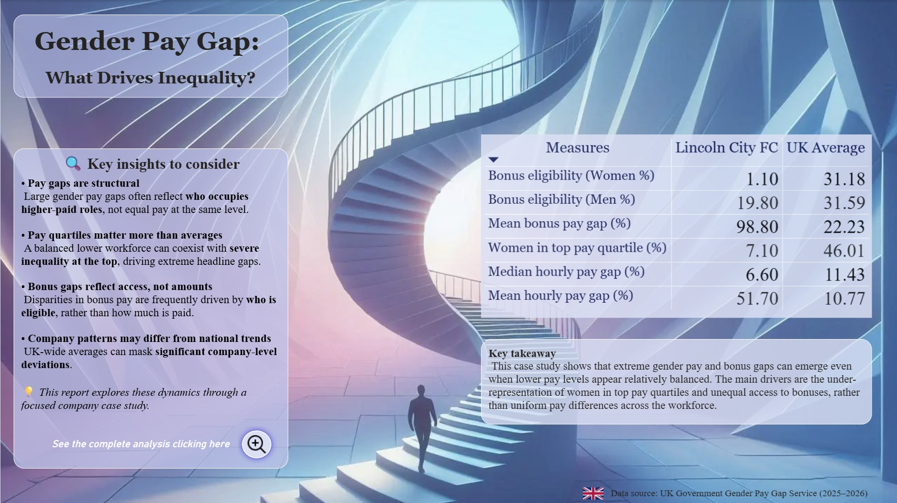
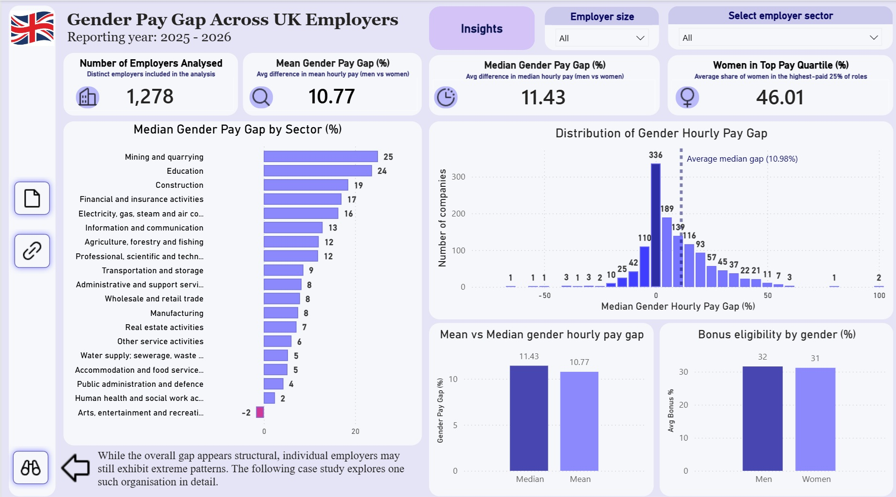
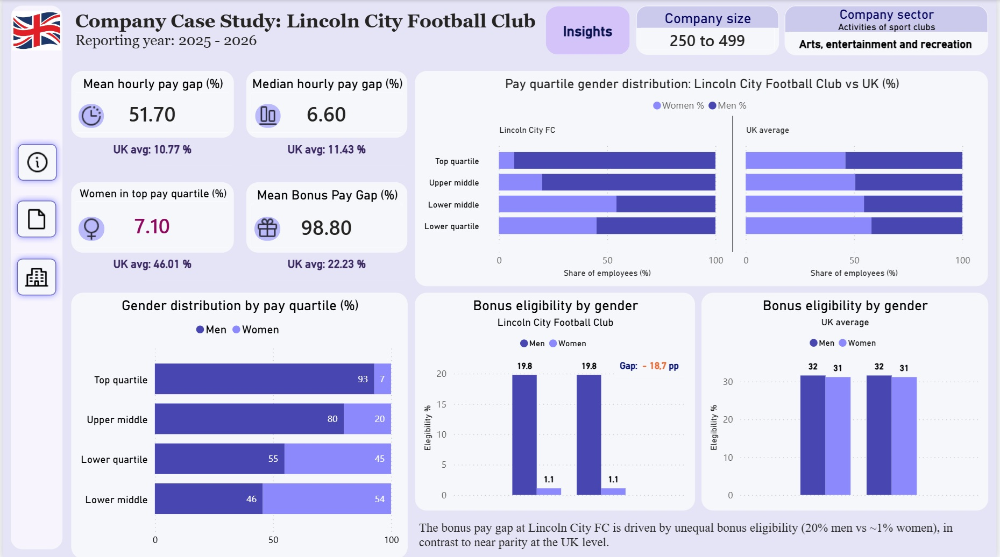

# 📊 Gender Pay Gap Analysis — UK Employers

## 📌 Project overview

In this project, I analyzed gender pay gap data reported by UK employers (2025–2026), combining a national-level overview with a focused company case study of Lincoln City Football Club.
The report explores how gender pay inequality varies across industries, employer sizes, and pay structures, and why headline pay gaps often reflect structural workforce patterns rather than equal pay differences alone.

## 📊 Project focus

### This project focuses not only on visualization, but on analytical storytelling and structural interpretation, addressing questions such as:

- How gender pay gaps differ across UK sectors
- Why mean and median pay gaps can diverge
- How women’s representation in top pay quartiles affects headline gaps
- Whether bonus pay gaps reflect bonus size or access to bonuses
- How individual employers can deviate strongly from national averages

## 🧠 Analytical approach

### The report combines:

- Employer-level gender pay metrics
- Sector-level aggregation using UK SIC codes
- Pay quartile gender distribution
- Bonus eligibility analysis

This approach allows comparison between UK-wide structural patterns and company-specific outcomes, highlighting how inequality often emerges at higher-paid and senior levels.

## 🛠️ Skills practiced

**This project helped me practice and strengthen:**

- Data modeling in Power BI
- Advanced DAX measures
- KPI and executive summary design
- Sector-based analysis using classification systems (SIC)
- Analytical storytelling with interactive dashboards

## 🔍 Additional insights

**Beyond high-level KPIs, the report includes:**

- Distribution analysis of median gender hourly pay gaps
- Sector comparisons highlighting structural inequality
- Pay quartile analysis showing where imbalance emerges
- Bonus eligibility analysis separating access from amount
- An interactive insights panel explaining key findings in context

## 📊 Tools & Technologies

- Power BI (Power BI Desktop & Power BI Service)
- DAX
- UK SIC Classification

## 🧭 Interactivity

**The report is fully interactive. Users can:**

- Filter by employer size
- Select industry sectors
- Explore how distributions and KPIs change dynamically
- Navigate between overview and company-level analysis using buttons

🔗 Interactive Power BI report:
(https://app.powerbi.com/view?r=eyJrIjoiMjZiYjgyMzYtZWZjZS00N2MxLWEwZDItN2Y3MTJlMjhhNzNkIiwidCI6IjY1NWVhZjVhLTBhMTctNDEzOS05NzU5LTFlMDIzMTRkMDJhYiIsImMiOjZ9)

## 🔒 Data & Files Availability

Due to data ownership and privacy considerations: 
The Power BI (.pbix) file, Source datasets are not publicly available.
Access is provided via the interactive report link.
Additional details can be shared upon request.

## 📈 Key insights

- Gender pay gaps are often structural, not role-based
- Under-representation of women in top pay quartiles is a major driver of inequality
- Mean and median gaps capture different aspects of pay distribution
- Bonus pay gaps frequently reflect who is eligible, not bonus size
- Company-level patterns can differ sharply from UK-wide averages

## 📷 Report preview
### Executive Overview — UK-wide gender pay gap patterns

### Sector-Level Analysis — median gender pay gap by industry and employer size

### Company Case Study — Lincoln City Football Club

📝 Notes

This project was developed as an independent analytical case study.
Feedback on storytelling, KPIs, and report structure is very welcome.
